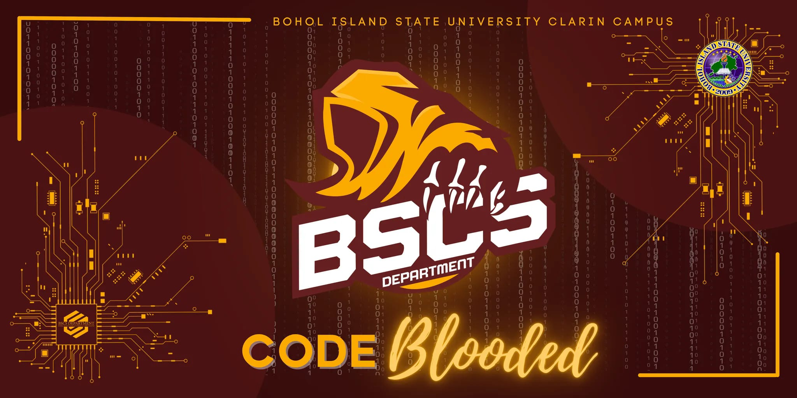

  

<!-- Header Section -->
<h1 align="center">✨ Hey there! I’m Richmond C. Torreon ✨</h1>

  💻 <b>Computer Science Student</b> | Bohol Island State University – Clarin Campus  
  🌐 Web & Mobile Developer • UI/UX Enthusiast • Problem Solver

---

<!-- About Me -->
## 👨‍💻 About Me  
I'm a passionate **student developer** with a keen interest in building **modern, user-centric digital solutions**.  
I transform ideas into **fast, functional, and visually stunning products**.

- 🚀 Focused on **Web & Mobile App Development**
- 🎯 Passionate about **UI/UX Excellence** & **User-Centered Design**
- 📚 Constantly learning, building, and improving
- 🤝 Open to collaborations & new opportunities

---

<!-- Tech Stack -->
## 🛠 Tech Stack

### 🌐 **Web Development**

  
  
  
  
  
  
  

### 📱 **Mobile Development**

  
  
  

### 🧠 **Machine Learning & Python**

  
  

### 🖌 **UI/UX Design**

  

### 🔧 **Other Technologies**

  

---

<!-- Services -->
## 🧩 Services I Offer  
- 🌍 **Web Development** – Crafting modern, responsive, and scalable websites  
- 📱 **Mobile App Development** – Building seamless & engaging mobile experiences  
- 🎨 **UI/UX Design** – Designing clean, user-friendly, and modern interfaces  
- 🧠 **Software Consulting** – Providing tailored solutions for businesses

---

<!-- GitHub Stats -->
## 📊 GitHub Highlights  

  
  

---

<!-- Portfolio -->
## 🌐 Portfolio  
🔗 **[richmondtorreon.vercel.app](https://richmondtorreon.vercel.app/)**  

---

  <i>✨ "Always learning. Always building." ✨</i>

